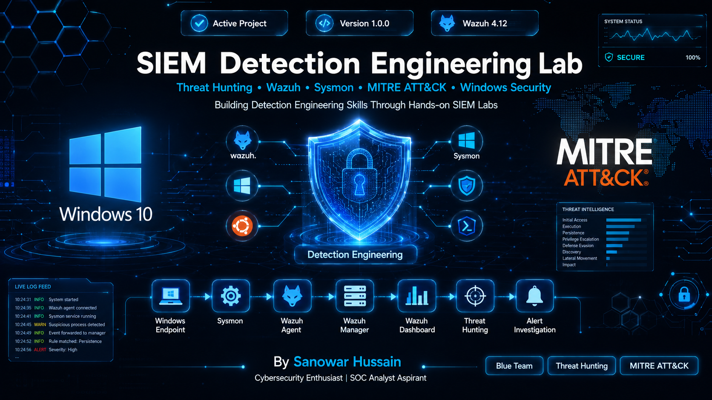

<p align="center">
  
</p>

<h1 align="center">🛡️ SIEM Detection Engineering Lab</h1>

<p align="center">
A hands-on Security Information and Event Management (SIEM) lab using <b>Wazuh</b>, <b>Sysmon</b>, <b>Windows 10</b>, and <b>Ubuntu</b> to simulate attacks, investigate security events, and map detections to the MITRE ATT&CK framework.
</p>

<p align="center">


</p>

# 📌 Project Overview

This project demonstrates the implementation of a complete SIEM environment for monitoring Windows endpoints using **Wazuh** and **Sysmon**.

The lab focuses on:

- Windows endpoint monitoring
- Threat hunting
- Detection engineering
- Incident investigation
- MITRE ATT&CK mapping
- Security event analysis
- Detection documentation

Every detection includes:

- Attack simulation
- Wazuh alert
- Investigation
- MITRE ATT&CK mapping
- Screenshots
- Technical documentation

---

# 🎯 Objectives

- Build a production-like SIEM environment
- Learn Wazuh detection engineering
- Analyze Windows telemetry using Sysmon
- Simulate attacker behavior
- Map detections to MITRE ATT&CK
- Document investigation procedures
- Create a cybersecurity portfolio project

---

# 🖥️ Lab Architecture

```
                    Windows 10 VM
                   ┌──────────────┐
                   │    Sysmon    │
                   │ Wazuh Agent  │
                   └──────┬───────┘
                          │
                    Event Forwarding
                          │
                          ▼
                Ubuntu Server (24.04)
          ┌─────────────────────────────┐
          │        Wazuh Manager         │
          │        Wazuh Indexer         │
          │       Wazuh Dashboard        │
          └─────────────┬───────────────┘
                        │
                        ▼
                Threat Hunting & Alerts
```

---

# 🛠️ Technology Stack

| Component | Technology |
|-----------|------------|
| SIEM | Wazuh 4.12 |
| Endpoint Monitoring | Sysmon |
| Endpoint OS | Windows 10 |
| SIEM Server | Ubuntu 24.04 |
| Virtualization | Oracle VirtualBox |
| Detection Mapping | MITRE ATT&CK |
| Documentation | Markdown |
| Version Control | Git & GitHub |

---

# ✅ Completed Detections

| # | Detection | Rule ID | MITRE | Status |
|---|-----------|---------|--------|--------|
| 01 | Discovery Activity | 92031 | T1087 | ✅ |
| 02 | PowerShell Execution | 92027 | T1059.001 | ✅ |
| 03 | Encoded PowerShell | 92057 | T1059.001 | ✅ |
| 04 | Suspicious File Creation | 92213 | T1105 | ✅ |
| 05 | User Account Discovery | 92031 | T1087 | ✅ |

---

# 📂 Repository Structure

```
SIEM-Detection-Lab
│
├── assets/
│
├── configs/
│
├── docs/
│   ├── architecture/
│   ├── attacks/
│   ├── detection/
│   │   ├── 01-discovery-activity.md
│   │   ├── 02-powershell-detection.md
│   │   ├── 03-encoded-powershell.md
│   │   ├── 04-high-severity-alert-investigation.md
│   │   ├── 05-user-account-discovery.md
│   │   └── detection-matrix.md
│   │
│   ├── troubleshooting/
│   ├── windows-event-ids.md
│   ├── statistics.md
│   └── README.md
│
├── screenshots/
│
├── scripts/
│
├── README.md
│
└── LICENSE
```

---

# 📈 MITRE ATT&CK Coverage

| Technique | Description |
|------------|-------------|
| T1087 | Account Discovery |
| T1059.001 | PowerShell |
| T1105 | Ingress Tool Transfer |

More techniques will be added as the lab progresses.

---

# 📊 Detection Statistics

### Completed Detections

- ✅ Discovery Activity
- ✅ PowerShell Execution
- ✅ Encoded PowerShell
- ✅ Suspicious File Creation
- ✅ User Account Discovery

### Windows Sysmon Events

- Event ID 1 – Process Creation
- Event ID 11 – File Creation
- Event ID 13 – Registry Value Set
- Event ID 3 – Network Connection (Telemetry Verified)

### Wazuh Rules

- 92027
- 92031
- 92057
- 92213

---

# 🔎 Threat Hunting Workflow

```
Attack Simulation
        │
        ▼
Windows Endpoint
        │
        ▼
Sysmon Event
        │
        ▼
Wazuh Agent
        │
        ▼
Wazuh Manager
        │
        ▼
Indexer
        │
        ▼
Dashboard
        │
        ▼
Threat Hunting
        │
        ▼
Detection Investigation
```

---

# 📅 Project Progress

```
█████░░░░░ 50%
```

- [x] Detection 01
- [x] Detection 02
- [x] Detection 03
- [x] Detection 04
- [x] Detection 05
- [ ] Detection 06
- [ ] Detection 07
- [ ] Detection 08
- [ ] Detection 09
- [ ] Detection 10

---

# 🚀 Upcoming Work

- Process Discovery Detection
- System Information Discovery
- Service Discovery
- Scheduled Task Detection
- Security Software Discovery
- Custom Wazuh Rules
- Sigma Rules
- YARA Integration
- Active Response
- Detection Dashboard Improvements

---

# 📚 Key Learning Outcomes

- Wazuh SIEM Deployment
- Sysmon Configuration
- Windows Event Monitoring
- Threat Hunting
- Detection Engineering
- Security Investigation
- MITRE ATT&CK Mapping
- Incident Documentation

---

# 👨‍💻 Author

**Sanowar Hussain**

Cybersecurity Enthusiast | SOC Analyst Aspirant | Detection Engineering Learner

- GitHub: https://github.com/sanor07
- LinkedIn: https://linkedin.com/in/sano18

---

## ⭐ If you found this project useful, consider giving it a star!
