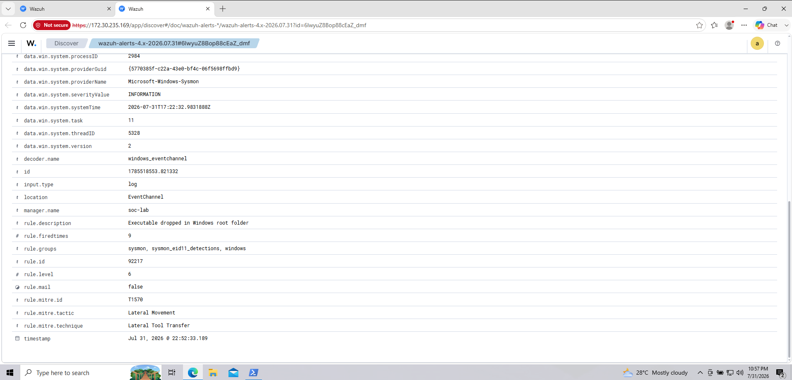
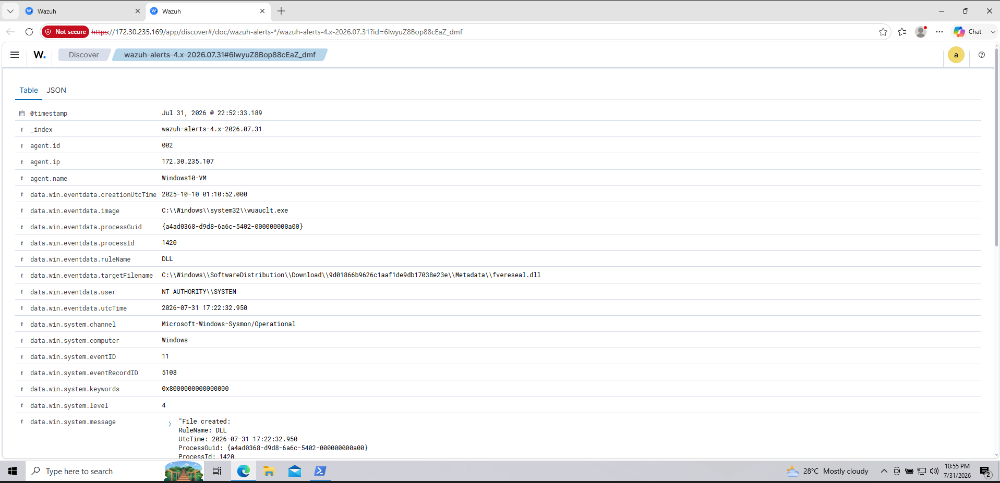

# Detection 06: Executable Dropped in Windows Root Folder

## Overview

This detection demonstrates how Wazuh and Sysmon identify executable file creation events on a Windows endpoint. During the investigation, Wazuh generated an alert when a DLL file was created by the Windows Update process.

Although the rule triggered successfully, the investigation concluded that the activity was legitimate and not malicious.

---

## Objective

Detect executable files created on the Windows endpoint and investigate whether the activity represents a potential security threat or a legitimate operating system process.

---

## MITRE ATT&CK Mapping

| Category | Value |
|----------|-------|
| Tactic | Lateral Movement |
| Technique | T1570 - Lateral Tool Transfer |

---

## Lab Environment

| Component | Value |
|----------|-------|
| SIEM | Wazuh 4.12 |
| Endpoint | Windows 10 VM |
| Server | Ubuntu 24.04 |
| Monitoring | Sysmon |
| Log Source | Microsoft-Windows-Sysmon/Operational |

---

## Detection Rule

| Field | Value |
|------|------|
| Rule ID | 92217 |
| Rule Description | Executable dropped in Windows root folder |
| Rule Level | 6 |
| Event ID | Sysmon Event ID 11 (File Create) |

---

## Alert Summary

The Wazuh manager generated an alert after Sysmon detected the creation of an executable file (.dll).

The event was correlated using the built-in Wazuh detection rule for executable file creation inside monitored Windows directories.

---

## Investigation

### Process Responsible

```
C:\Windows\System32\wuauclt.exe
```

### File Created

```
C:\Windows\SoftwareDistribution\Download\...\Metadata\fvereseal.dll
```

### User

```
NT AUTHORITY\SYSTEM
```

### Event Source

```
Microsoft-Windows-Sysmon/Operational
```

### Sysmon Event

```
Event ID 11 - File Create
```

---

## Analysis

The process responsible for the file creation was:

```
wuauclt.exe
```

This executable is the Windows Update Client responsible for downloading and installing Windows updates.

The created DLL was located inside:

```
C:\Windows\SoftwareDistribution\Download\
```

This directory is used by Windows Update to temporarily store update packages before installation.

No suspicious PowerShell, command execution, encoded payloads, or malicious parent process relationships were observed.

---

## Investigation Result

**Verdict:** Benign Activity

The alert correctly detected the creation of an executable file.

However, analysis confirmed that the activity was generated by the legitimate Windows Update service and does not indicate malicious behavior.

This demonstrates the importance of validating alerts before classifying them as security incidents.

---

## Indicators Collected

| Indicator | Value |
|-----------|------|
| Process | wuauclt.exe |
| File Type | DLL |
| Event ID | 11 |
| Rule ID | 92217 |
| User | NT AUTHORITY\SYSTEM |

---

## Screenshots

### Alert Overview



---

### Alert Details



---

### Event JSON


---

## Key Learning

- Understand how Sysmon Event ID 11 monitors file creation events.
- Learn how Wazuh correlates Sysmon telemetry into security alerts.
- Practice distinguishing legitimate Windows activity from suspicious behavior.
- Develop investigation skills by validating the process, file path, and execution context before determining the severity of an alert.

---

## References

- Wazuh Documentation
- Microsoft Sysmon Documentation
- MITRE ATT&CK T1570 – Lateral Tool Transfer

---

## Status

**Completed**
